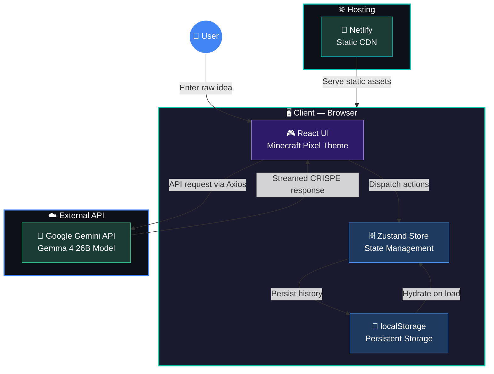
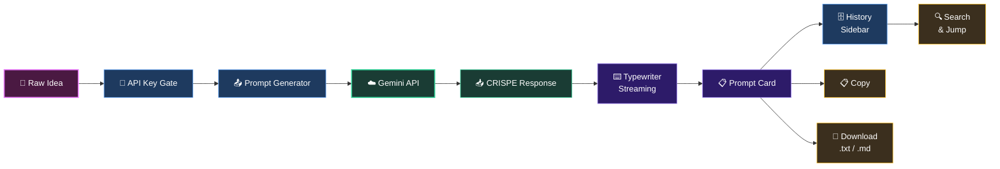
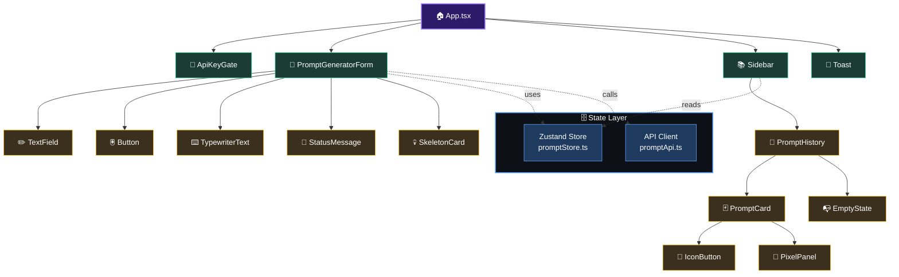

<div align="center">

# ⛏️ CRISPE Prompt Forge

### Transform raw ideas into battle-ready CRISPE-framework prompts — powered by AI.

[](https://crispe-ai.netlify.app)


<br/>

*An AI-powered prompt engineering tool that structures your raw ideas into the **CRISPE framework** — Context, Role, Instruction, Specification, Performance & Example — using Google's Gemma 4 26B model. Wrapped in a Minecraft-themed pixel UI with typewriter streaming, sound effects, and full prompt history.*

</div>

---

## ✨ Features

| Feature | Description |
|---------|-------------|
| 🧠 **CRISPE Framework** | Auto-structures ideas into Context, Role, Instruction, Specification, Performance & Example |
| ⌨️ **Live Typewriter** | Watch prompts being crafted in real-time with animated streaming output |
| 🤖 **AI-Powered** | Google's **Gemma 4 26B** via the Gemini API for high-quality prompt generation |
| 📜 **Prompt History** | All generated prompts saved locally in your browser via `localStorage` |
| 🔍 **Search & Jump** | Instantly find past prompts by keyword or scroll to them |
| 📋 **Copy & Download** | One-click copy to clipboard or download as `.txt` / `.md` |
| 🎮 **Minecraft Pixel Theme** | Immersive dark UI with pixel-perfect Minecraft-inspired design |
| 🔊 **Villager Sound** | A satisfying *"Hmm"* villager sound plays when your prompt is forged |
| 📱 **Mobile Friendly** | Responsive layout with slide-out drawer sidebar for mobile devices |
| 🌑 **Dark Theme Only** | Permanent Cave Mode for the best experience |
| 🔑 **BYOK** | Bring your own Gemini API key — no shared quota, no backend costs |

---

## 🏗️ Architecture

### System Overview



### Data Flow



### Component Hierarchy



---

## 🧩 What is the CRISPE Framework?

CRISPE is a structured prompt engineering methodology designed to produce consistently high-quality AI outputs:

```
┌─────────────────────────────────────────────────────┐
│  C - Context        → Background info & constraints │
│  R - Role           → Who the AI should act as      │
│  I - Instruction    → The specific task to perform   │
│  S - Specification  → Format, tone & requirements   │
│  P - Performance    → Quality & evaluation criteria  │
│  E - Example        → Sample output for reference    │
└─────────────────────────────────────────────────────┘
```

**CRISPE Prompt Forge** takes your rough idea and automatically generates a complete, structured prompt following this framework — ready to use with any LLM.

---

## 🛠️ Tech Stack

| Layer | Technology |
|-------|------------|
| **Framework** | React 18 + TypeScript 5 |
| **Build Tool** | Vite 5 |
| **Styling** | Tailwind CSS 3 |
| **State Management** | Zustand (persisted to `localStorage`) |
| **Animation** | Framer Motion |
| **Icons** | Lucide React |
| **AI Model** | Gemma 4 26B (Google Gemini API) |
| **HTTP Client** | Axios |
| **Fonts** | Press Start 2P (pixel) + Inter (body) |
| **Hosting** | Netlify (static deployment) |

---

## 📁 Project Structure

```
CRISPE-AI/
├── src/
│   ├── api/
│   │   └── promptApi.ts                  # Gemini API client
│   ├── components/
│   │   ├── ApiKeyGate.tsx                # API key entry screen
│   │   ├── Button.tsx                    # Reusable pixel button
│   │   ├── EmptyState.tsx                # Empty history placeholder
│   │   ├── IconButton.tsx                # Icon action button
│   │   ├── PixelPanel.tsx                # Minecraft-styled panel
│   │   ├── PromptCard.tsx                # Prompt result card
│   │   ├── Sidebar.tsx                   # Desktop/mobile sidebar
│   │   ├── SkeletonCard.tsx              # Loading skeleton
│   │   ├── TextField.tsx                 # Form input
│   │   └── Toast.tsx                     # Toast notification
│   ├── features/
│   │   └── promptGenerator/
│   │       ├── PromptGeneratorForm.tsx    # Composer with streaming
│   │       ├── PromptHistory.tsx          # History list
│   │       └── index.ts
│   ├── store/
│   │   └── promptStore.ts                # Zustand store + localStorage
│   ├── App.tsx                           # Main app entry
│   ├── main.tsx                          # React DOM render
│   ├── types.ts                          # TypeScript types
│   └── index.css                         # Tailwind + custom styles
├── dist/                                 # Production build output
├── index.html                            # HTML entry point
├── netlify.toml                          # Netlify deployment config
├── tailwind.config.js                    # Tailwind theme config
├── vite.config.ts                        # Vite configuration
├── tsconfig.json                         # TypeScript config
└── package.json                          # Dependencies
```

---

## 🚀 Getting Started

### Prerequisites

- **Node.js** ≥ 18
- **npm** ≥ 9
- A free **Google Gemini API key** — [Get one here](https://aistudio.google.com/apikey)

### Installation

```bash
# Clone the repository
git clone https://github.com/kushal98457-ctrl/CRISPE-AI.git

# Navigate to the project directory
cd CRISPE-AI

# Install dependencies
npm install

# Start the development server
npm run dev
```

The app will be available at `http://localhost:5173`.

### Build for Production

```bash
npm run build
npm run preview    # Preview the production build locally
```

---

## 🎮 Usage Guide

1. **Enter API Key** — Paste your Gemini API key on the welcome screen
2. **Type Your Idea** — Describe what you want (e.g., *"Build a BTC vs ETH price plotter"*)
3. **Watch It Forge** — Status messages cycle while the AI works its magic (`Ctrl+Enter` to submit)
4. **Review Output** — The CRISPE prompt appears with live typewriter effect
5. **Copy or Download** — Copy to clipboard or save as `.txt` / `.md`
6. **Browse History** — Use the sidebar to search and jump between past prompts
7. **Change API Key** — Click "Change API Key" in the sidebar footer

---

## 🎨 Theming

The app features a **Minecraft-inspired pixel theme** with:

- 🕳️ **Cave Mode** — Dark, atmospheric deepslate and stone textures
- 🧱 **Pixel-Perfect UI** — Custom block shadows, pixel fonts, and grid backgrounds
- 💎 **Mob-Inspired Colors** — Emerald (grass), Diamond (rare), Gold, Redstone, Nether
- 🔊 **Sound Effects** — Villager *"Hmm"* sound on successful generation

---

## 🌐 Deployment

This project is configured for **Netlify** out of the box:

1. Push your code to GitHub
2. Connect the repo to [Netlify](https://netlify.com)
3. Set build command to `npm run build` and publish directory to `dist`
4. Deploy!

Or use the CLI:

```bash
npm install -g netlify-cli
netlify deploy --prod --dir=dist
```

---

## 🤝 Contributing

Contributions are welcome! Here's how to get started:

1. **Fork** the repository
2. **Create** a feature branch: `git checkout -b feature/amazing-feature`
3. **Commit** your changes: `git commit -m "feat: add amazing feature"`
4. **Push** to the branch: `git push origin feature/amazing-feature`
5. **Open** a Pull Request

Feel free to [open an issue](https://github.com/kushal98457-ctrl/CRISPE-AI/issues) for bug reports or feature requests.

---

## 📄 License

This project is open source under the **MIT License** — see the [LICENSE](LICENSE) file for details.

---

## 👨‍💻 Created by

**Kushal H** & **Pranav S**

---

<div align="center">

**Built with ❤️ and a Minecraft pickaxe**

[⬆ Back to Top](#️-crispe-prompt-forge)

</div>
